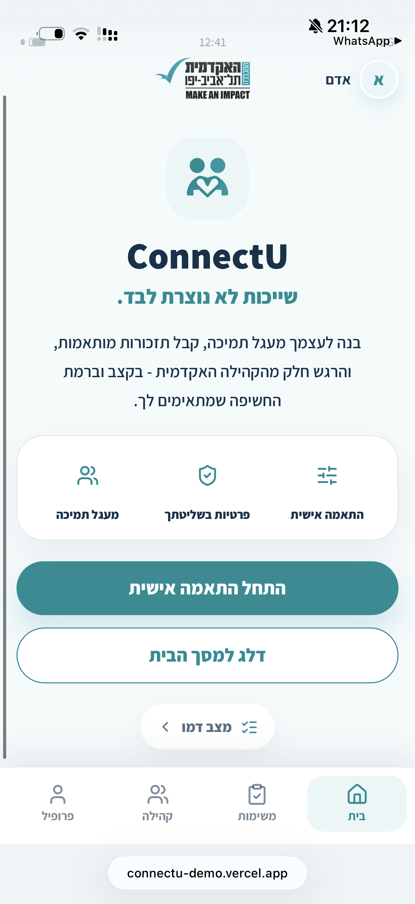
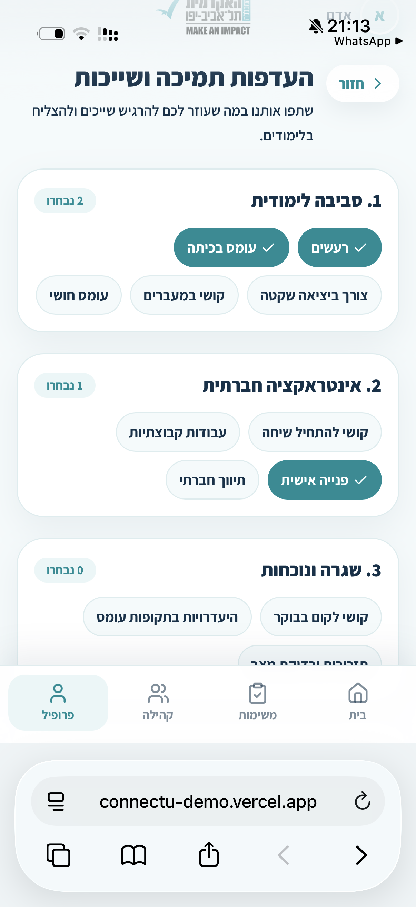
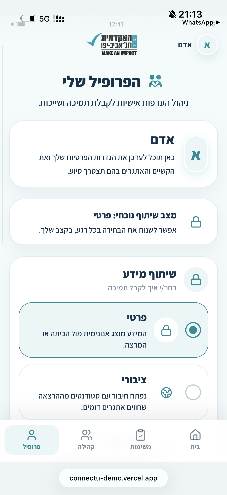
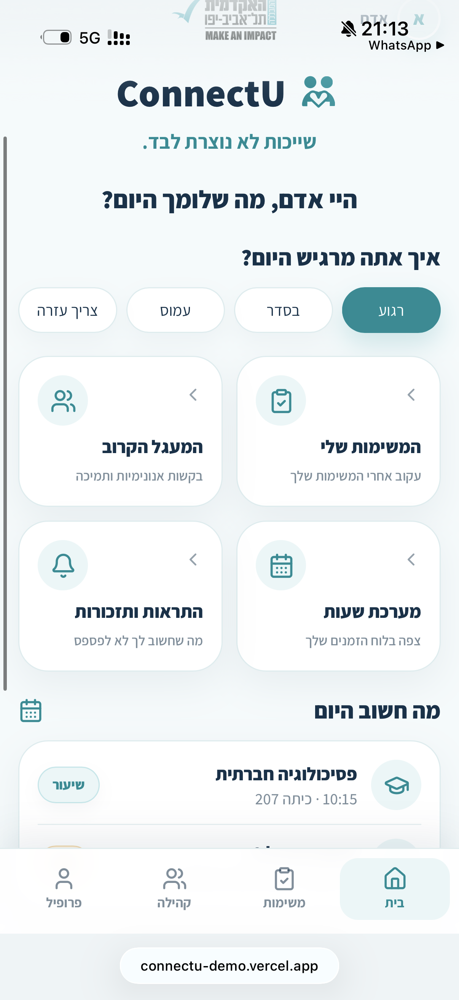
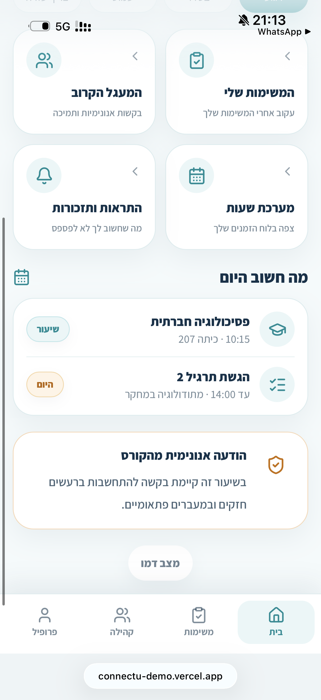
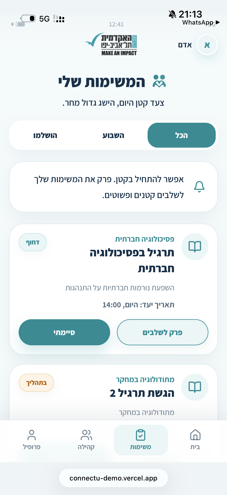
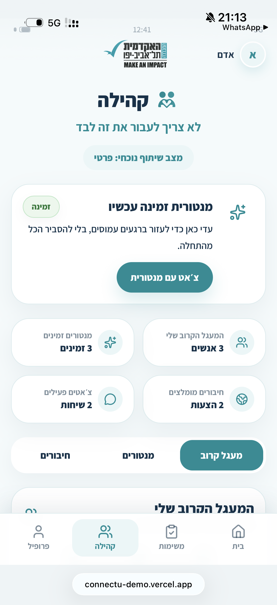

# ConnectU Product Walkthrough

ConnectU was created during a college accessibility hackathon focused on improving the academic experience for students with physical and mental disabilities.

The prototype translates that broad challenge into a small set of connected product flows that can be experienced directly on mobile.

## 1. Introduction and product promise

The first screen communicates three product ideas before asking for any setup:

- personal adaptation;
- privacy under the student's control;
- a support circle that reduces the feeling of handling accessibility needs alone.

This establishes the product as a support layer around academic life rather than a diagnosis or medical tool.

## 2. Support preferences

Students select practical needs through grouped chips instead of completing a long disclosure form.

Examples include environmental load, social interaction, routine, group work, and campus participation.

### Product rationale

This structure reduces writing effort, makes needs easier to scan, and creates product data that could later map to specific support actions or accessibility accommodations.

## 3. Privacy and sharing

The prototype supports different disclosure states, including private, public, and close-circle sharing.

The important UX choice is that privacy is not hidden inside settings after onboarding. The current sharing state remains visible and editable so users can understand and change how their information is used.

## 4. Daily academic experience

The home experience combines academic context with lightweight support entry points.

It brings together:

- mood or current-state check-in;
- upcoming academic activity;
- tasks;
- reminders;
- close-circle access;
- support actions.

This reflects the product hypothesis that accessibility support is more useful when it is integrated into the student's routine rather than separated into a dedicated accessibility portal.

## 5. Contextual and anonymous support

The course experience explores how a need can become actionable without exposing the individual student.

For example, the interface can communicate that students in a class may benefit from stronger breaks or transitions without identifying who requested the adjustment.

### Product rationale

This is one of the core tensions in the concept: making support visible enough to be useful while minimizing unnecessary disclosure.

## 6. Tasks and task decomposition

Academic tasks are part of the same product because accessibility can also involve executive-function load, planning, and difficulty starting large assignments.

The prototype includes task status and the option to break larger assignments into smaller steps.

## 7. Community, mentors, and close circle

The community layer includes mentors, recommended connections, and a close support circle.

The concept deliberately avoids making public community participation mandatory. Students can remain private, use selected trusted contacts, or engage more broadly depending on their preference.

## Product principles demonstrated by the prototype

- **Accessibility through adaptation:** the system changes around the user's needs instead of requiring one standard workflow.
- **Privacy by choice:** disclosure is visible, adjustable, and purpose-driven.
- **Needs over diagnoses:** the interface focuses on actionable support requirements.
- **Low cognitive load:** large touch targets, grouped choices, limited visual density, and repeated patterns reduce interaction complexity.
- **Academic continuity:** accessibility, tasks, community, and daily academic context live in one experience.
- **Rapid validation:** the hackathon prototype prioritizes testing the interaction model before adding production infrastructure.

## If the concept moved beyond the hackathon

The next step would not be to build every prototype feature immediately. I would first validate the core trust and accessibility assumptions through user research with students with different physical, sensory, cognitive, and mental-health-related accessibility needs.

The smallest realistic MVP would likely focus on support preferences, explicit privacy controls, a trusted close circle, contextual support requests, and lightweight academic reminders before expanding into broader community or institutional integrations.
